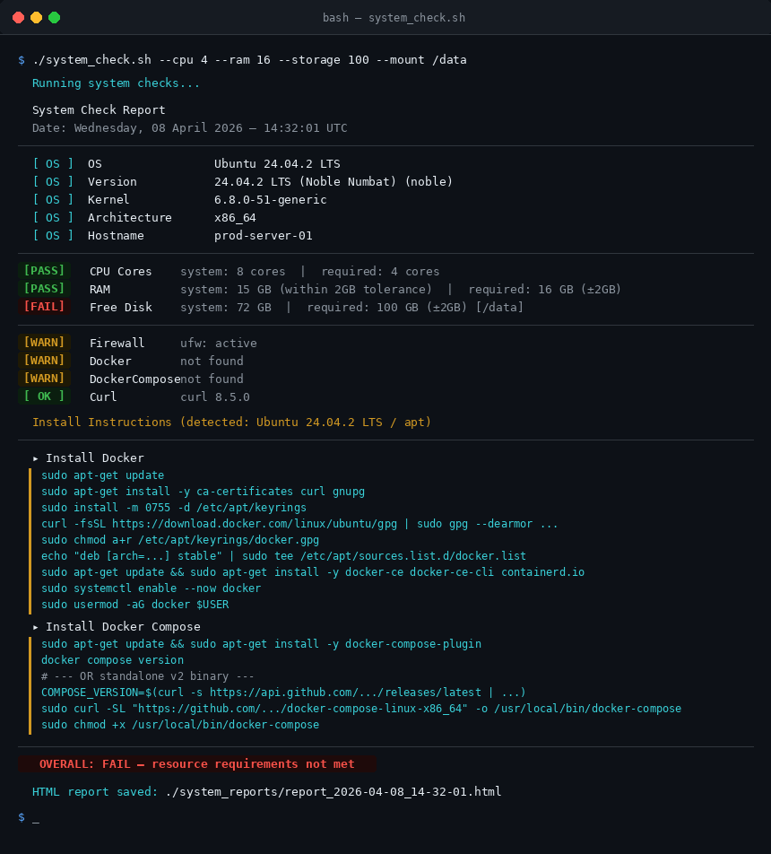

# system_check.sh

A pre-flight system requirements checker for Linux. Validates CPU, RAM, disk space, OS details, firewall status, and required packages — then produces a colour-coded terminal summary and a timestamped HTML report. If any package is missing, distro-specific install instructions are provided automatically.



---

## Features

- **Resource validation** — checks CPU cores, RAM, and free disk space against your specified requirements
- **±2 GB tolerance** — RAM and storage values within 2 GB below the requirement still pass
- **Custom mount point** — check free space on any partition, not just `/`
- **OS detection** — reports distro name, version, codename, kernel, and architecture
- **Firewall status** — supports `ufw`, `firewalld`, and `iptables`
- **Package checks** — verifies Docker, Docker Compose, and curl are installed
- **Install instructions** — auto-generates the correct install commands for your distro when a package is missing (apt, rpm, pacman, zypper, apk)
- **HTML report** — saves a timestamped, styled report to `./system_reports/` on every run with expandable install steps
- **Colour-coded output** — green PASS, red FAIL, orange WARN at a glance

---

## Requirements

- Bash 4.0+
- Standard Linux utilities: `df`, `grep`, `awk`, `uname`, `hostname`, `nproc`
- No external dependencies required to run the script itself

---

## Usage

```bash
chmod +x system_check.sh
./system_check.sh --cpu <cores> --ram <GB> --storage <GB> [--mount <path>]
```

### Parameters

| Parameter | Required | Default | Description |
|-----------|----------|---------|-------------|
| `--cpu` | Yes | — | Minimum required CPU cores (integer) |
| `--ram` | Yes | — | Minimum required RAM in GB (integer) |
| `--storage` | Yes | — | Minimum required free disk space in GB (integer) |
| `--mount` | No | `/` | Mount point to check for free storage |
| `-h`, `--help` | No | — | Show usage information |

### Examples

```bash
# Basic check against root partition
./system_check.sh --cpu 4 --ram 16 --storage 100

# Check free space on a separate data partition
./system_check.sh --cpu 4 --ram 16 --storage 500 --mount /data

# Run with sudo for full firewall visibility
sudo ./system_check.sh --cpu 8 --ram 32 --storage 200 --mount /var/lib/docker
```

---

## Output

### Terminal

Each check is printed with a colour-coded status tag:

| Tag | Colour | Meaning |
|-----|--------|---------|
| `[PASS]` | 🟢 Green | Requirement met |
| `[FAIL]` | 🔴 Red | CPU / RAM / Storage is below the required value |
| `[WARN]` | 🟡 Orange | Firewall is active, or a required package is missing |
| `[ OK ]` | 🟢 Green | Package is available |
| `[ OS ]` | 🔵 Cyan | Informational OS detail |

When packages are missing, an **Install Instructions** block is printed immediately after the checks, showing the exact commands for your detected distro and package manager.

### HTML Report

Every run saves a report to:

```
./system_reports/report_YYYY-MM-DD_HH-MM-SS.html
```

The report includes:

- Overall pass/fail verdict banner
- Operating system details panel
- Resource check cards with progress bars and tolerance notes
- Software & security checks with **expandable install steps** (click to reveal/hide)
- Run timestamp, hostname, kernel, and architecture

Reports are never overwritten — each run creates a new timestamped file, so you have a full history of every check.

---

## Status Logic

### Resource checks (CPU, RAM, Storage)

CPU must meet or exceed the required value exactly. RAM and Storage use a **±2 GB tolerance** — if the system value is within 2 GB below the requirement, it still counts as a PASS and the terminal output notes `(within 2GB tolerance)`.

```
Required RAM: 16 GB
System RAM:   15 GB  →  PASS  (within 2GB tolerance)
System RAM:   13 GB  →  FAIL
```

### Software checks

| Condition | Status |
|-----------|--------|
| Firewall inactive / not found | OK |
| Firewall active | WARN |
| Package installed | OK / FOUND |
| Package missing | WARN / MISSING + install steps |

Software warnings do **not** affect the overall PASS/FAIL result — only resource shortfalls cause a FAIL.

---

## Supported Distros

Install instructions are generated automatically based on the detected package manager:

| Family | Distros |
|--------|---------|
| `apt` | Ubuntu, Debian, Linux Mint, Pop!_OS, Kali, Raspberry Pi OS |
| `rpm` | RHEL, CentOS, Fedora, Rocky Linux, AlmaLinux, Amazon Linux |
| `pacman` | Arch Linux, Manjaro, EndeavourOS |
| `zypper` | openSUSE, SLES |
| `apk` | Alpine Linux |

If the distro is not recognised, a link to the official documentation is shown instead.

---

## File Structure

```
.
├── system_check.sh                        # Main script
├── README.md                              # This file
└── system_sample_reports/                 # Sample outputs for reference
    ├── report_2026-04-08_14-32-01.html    # Sample HTML report
    └── terminal_output.png                # Sample terminal output screenshot
```

> Live reports generated by the script are saved to `./system_reports/` (created automatically on first run) in the directory where you execute the script.

---

## Notes

- Run with `sudo` if you want accurate firewall status from `ufw` or `iptables`, as these require elevated privileges to query
- The `--mount` path is validated before the checks run — the script exits immediately if the directory does not exist
- Docker Compose v2 (plugin) is checked first via `docker compose version`; the standalone `docker-compose` binary is used as a fallback